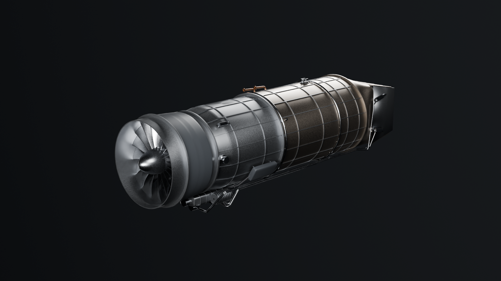
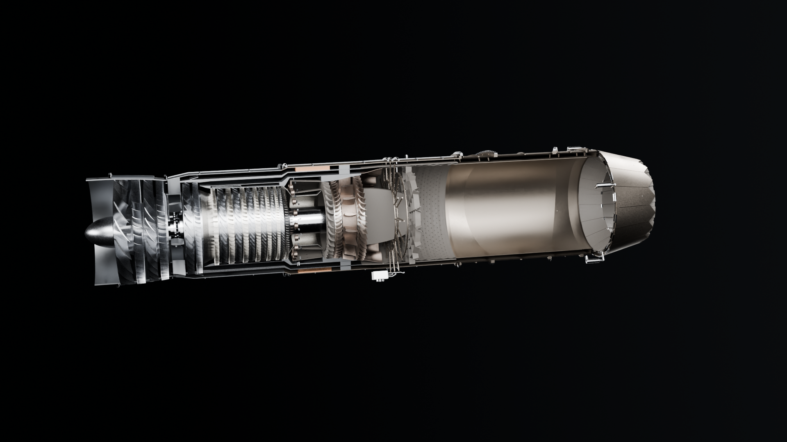
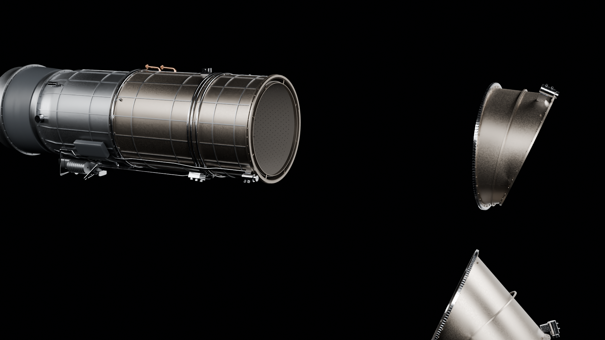
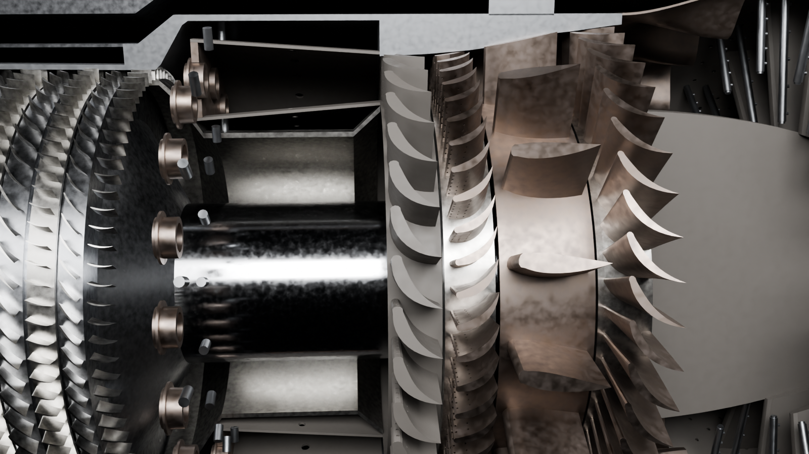
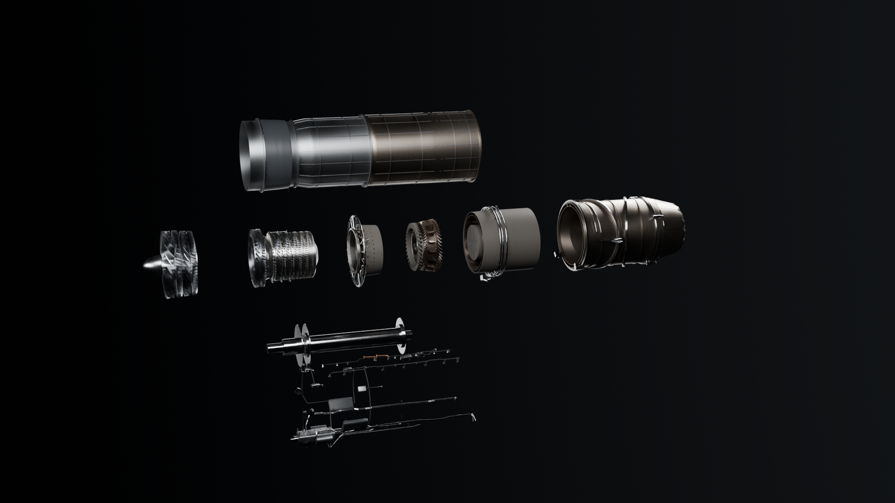
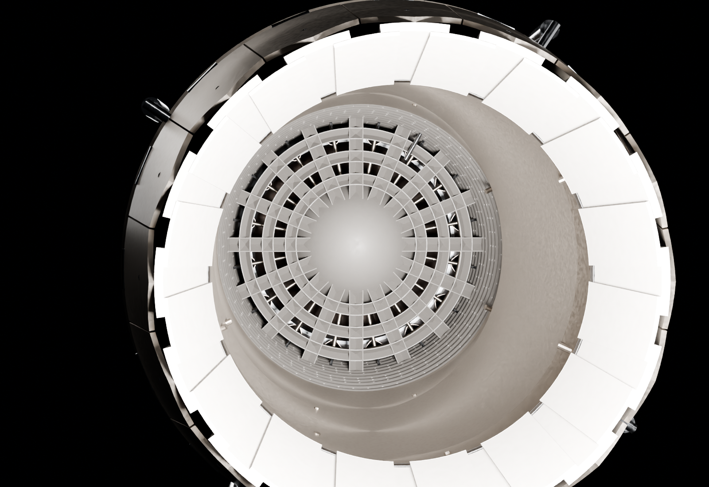
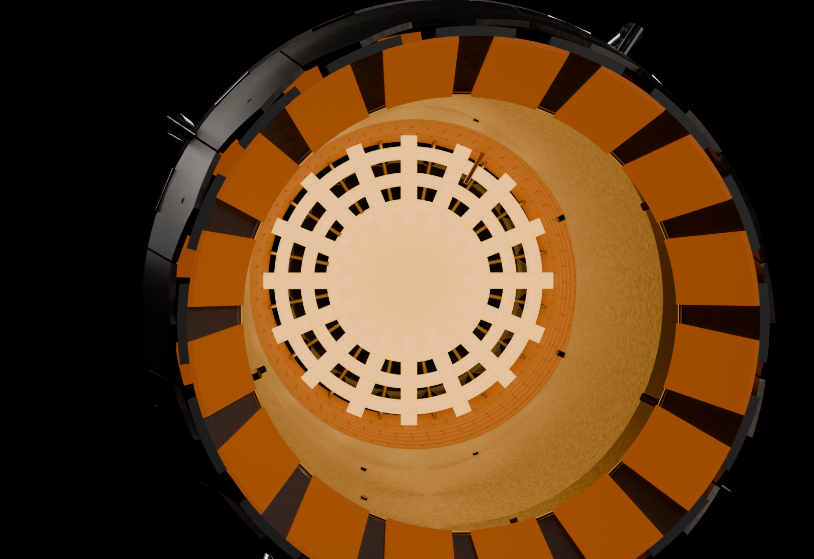

# Aether AX-1 — an adaptive-cycle fighter engine, designed from scratch

An original three-stream, reheated turbofan with a three-bearing swivel
nozzle that folds the jet 95 degrees down, sized to power the twin-engine [Nyx](https://github.com/Krabduke/nyx-jet)
agile fighter. It is not a model of any production engine: the cycle, the
flowpath, every blade row and every part are designed here, and the whole
engine is generated procedurally in Blender from one specification file.

This is **version 2** of the engine project. Version 1 modelled the GE
F110-GE-129 and is kept at [Krabduke/f110-turbofan](https://github.com/Krabduke/f110-turbofan)
(tag `v1`).



| | |
|---|---|
|  |  |
|  |  |
|  |  |

## The design

| | |
|---|---|
| Architecture | 2-stage blisk fan · 1-stage core-driven fan stage (CDFS) · 6-stage HP compressor · CMC annular combustor · 1-stage HP turbine · 1-stage LP turbine, counter-rotating · lobed mixer · three-zone augmentor · three-bearing swivel duct · axisymmetric C-D nozzle |
| Airflow | 112 kg/s at sea-level static |
| Thrust | **90.5 kN dry, 134.9 kN with reheat** (from the cycle, not typed in) |
| Pressure ratios | fan 3.8, CDFS 1.3, HPC 7.4 — **overall 36.6** |
| Turbine inlet | 2,050 K |
| Bypass ratio | 0.63 second stream (solved for a balanced mixer), 0.81 with the third stream |
| SFC | 21.4 mg/N·s dry, 42.3 reheat |
| Mass (estimated) | 1,590 kg with the swivel — reheat thrust-to-weight 8.7 |
| Size | 4.74 m long, 1.02 m over the swivel's bearings |
| Aerofoils | 1,186, every one individually lofted |
| Vectoring | 0–95° down and ±12° of yaw, anywhere in a 95° cone |

**Why these choices.** The engine exists to make an airframe turn hard, which
asks for a lot of thrust in a small, light package — so a hot, high-pressure
core behind a compact two-stage fan. An agile fighter spends most of its life
at part throttle, which is where a fixed low-bypass engine wastes fuel — so it
is an **adaptive cycle**: a core-driven fan stage on the HP spool and a third
stream behind a mode valve let the bypass ratio move without moving the fan.
The third stream also carries a **heat exchanger** that sinks the aircraft's
sensor and avionics heat load, and the HP spool drives two generators. The
exhaust ends in a **three-bearing swivel duct**: three round ducts on three
bearings, the second and third cut obliquely at 23.75° and leaning opposite
ways. Turning the middle duct half a turn one way and the aft duct half a
turn the other folds the jet through 4 × 23.75 = 95°, straight down and a
little forward, for a vertical landing; the front bearing steers the plane
the fold happens in, so the same three motors also vector the jet in pitch
and yaw anywhere inside that cone. On the end is a round convergent-divergent
nozzle whose throat and exit are the cycle's at max reheat.

**How the numbers hang together.** `engine/cycle.py` is a textbook
preliminary-design cycle (two-gas constant properties, polytropic efficiencies,
lumped cooling air). It does not take the bypass ratio as an input: a
mixed-flow turbofan only works if the core and bypass reach the mixer at the
same total pressure, so the cycle **solves** for the bypass ratio that does
that. Thrust, SFC, the nozzle throat area and its exit/throat ratio all come
out of it. `engine/spec.py` then draws a flowpath to carry those flows, and
`engine/verify.py` recomputes the axial Mach number the drawn annulus implies
at fifteen stations from the cycle's own mass flows and total conditions, the
solidity of every blade row, the axial gap between every pair of rows measured
off the lofted aerofoils, and the nozzle throat against the cycle's choked
area — and fails the build if any is out of band.

## What's modelled

| Module | Contents |
|---|---|
| Fan | Rotating spinner (no inlet guide vanes), two swept blisks — 18 wide-chord blades then 30 — stators, the inter-stage drum, fan case and aramid containment wrap |
| Frames and walls | Three concentric walls for three streams: outer case, intermediate case (its nose is the third-stream splitter), core cowl (its nose is the core splitter). Fan frame with eight struts, a fat king strut for the tower shaft, flanges with bolt rings |
| Compressor | CDFS blisk on the HP spool with a variable stator; swan neck; variable inlet guide vane; six-stage HP compressor on a drum with a disc under every rotor; variable-vane unison rings and spindles |
| Combustor | Exit guide vanes, combustor case and inner case, single-skin SiC/SiC CMC liners with real dilution holes, dome with 18 swirlers seated in real holes, liner mount pins, 18 fuel nozzles off a manifold, two igniters |
| Turbines | HP nozzle and HP rotor with real film-cooling holes (showerhead and pressure-side rows, in every aerofoil), HP disc, mid-turbine frame of 16 structural vanes, counter-rotating LP rotor and disc |
| Augmentor | 16-lobe mixer, tail cone, augmentor case, a corrugated CMC liner with 1,200 real screech-damping holes, and the flameholder you see looking up the nozzle: three concentric V-gutter rings tied by 16 radial V-gutters that also carry the tail cone. Three staged reheat zones spray from concentric spray rings with 144 orifices, zone 1 on feeds from its manifold, zones 2 and 3 on 32 radial spraybars, each off its own manifold through a reheat fuel control with three zone valves, and a reheat igniter in the middle gutter's wake |
| Swivel duct | Fixed ring on the outer case, three double-walled ducts (structural shell outside a cooling liner on hangers, the third stream between), three bearings each a flange pair round a race with a 150-tooth ring gear, three hydraulic motors with pinions in mesh, and a rotary union and a swivel coupling at each bearing carrying pressure and return to the motors that turn and, through two rings round the aft duct, to the four nozzle actuators |
| C-D nozzle | Static ring, 16 convergent flaps and 16 seals, 16 divergent flaps and seals, each flap with a backbone, 16 serrated external flaps on compression links, hinge knuckles at the static ring and the throat, a unison ring on links to every convergent flap, and four actuators turning it through bellcranks |
| Spools | LP and HP shafts, five bearings (inner race, outer race, a full ring of balls or rollers) in two sumps hung from the fan frame and the mid-turbine frame |
| Third stream | Mode valve (24 petals), 12-segment plate-fin heat exchanger, coolant lines to the aircraft |
| Externals | Orthogrid stiffening on the outer cases, accessory gearbox with ribs, tower shaft off a bevel on the HP shaft, two starter-generators (the engine starts electrically, from the aircraft's bus), fuel pump, fuel-oil heat exchanger and metering unit, oil tank and lines to both sumps, fuel lines to both manifolds, two FADEC channels on stand-offs with their looms, each channel's own instrumentation loom along an upper flank to seven pressure, temperature and flame probes, three ignition exciters with their HT leads to the two main igniters and the reheat igniter, forward trunnions, an aft thrust lug, electromechanical mode-valve actuators on a loom from FADEC A, a customer bleed port with its shut-off valve through the fan frame's top strut for the aircraft's air conditioning, and a hydraulic pump feeding the swivel's motors |

## Build

Requires Blender (`brew install --cask blender`) and Python 3 with numpy.

```
make cycle      # print the thermodynamic design point
make build      # generate geometry, assemble build/aether.blend, write parts.csv
make verify     # every gate below  <- the definition of done
make render     # hero, rear quarter, cutaway, exploded
make bom        # bom.csv: every part, its group, material, pieces and size
make drawings   # drawings.pdf: A1 GA and assembly sheets, third angle, to scale, dimensioned,
                #   ballooned, with parts lists
make closeups   # detail shots used to inspect the model
make web        # decimated, Draco-compressed GLB for the viewer
make viewer     # serve the viewer on http://localhost:8791/viewer/
```

## The viewer

```
make web        # build/aether_web.glb, Draco-compressed (committed)
make viewer     # http://localhost:8791/viewer/
```

A three.js page built around the engine's own flowpath. Along the bottom is
the real meridional annulus, drawn from `spec.py`, filled with the gas
temperature at the current throttle and numbered with the standard gas-path
stations; hovering any part names it and lights its axial span there.

- **Throttle** Off / Idle / Military / Max reheat: the two spools spool up at
  their own rates and turn opposite ways; N1, N2, thrust and turbine inlet
  temperature read out live. Reheat lights the flame -- a tapering sheath
  with a hot core and a train of shock diamonds, following the nozzle -- and
  the gutters, spray rings, liner and tail cone glow at heat.
- **Nozzle down** 0–95° and **Nozzle yaw** ±12°: the three swivel bearings
  turn at a motor's pace to point the jet — the middle and aft ducts fold it
  off the axis, the front bearing puts the fold where it is asked for. The
  bearing centres and axes come from the geometry, through the manifest.
- **Cutaway** peels the static shells on the viewer's side, as in the renders.
- **Airflow** particles ride the core, bypass and third-stream annuli,
  coloured by total temperature from the cycle.

Nothing engineering lives in the HTML: spools, hinge points, palette,
flowpath and temperatures all come from `viewer/parts.json`, which is
generated from the build and checked against it by `audit_manifest`.

## The gates

`make verify` runs eleven checks, and all of them pass:

| Gate | What it enforces |
|---|---|
| `engine/verify.py` | the cycle closes (turbine work = compressor work, balanced mixer); Mach number at every station; solidity of every row; axial gaps off the real aerofoils; tip radii; nozzle throat = the cycle's choked area; the swivel folds 95° and its bearing schedule points the jet within 0.05° anywhere in its range; spool membership and counter-rotation — 120 checks |
| `audit_watertight` | every part is a closed surface |
| `audit_geometry` | no part too crude to be what it is named |
| `audit_structure` | attached, mirrored, distinct, singletons, named shapes |
| `audit_intersect` | exact BVH interference: every overlap is a declared joint (a blade root in its disc, a vane in its case, a fuel nozzle through the cases it passes). **KNOWN defects: none** |
| `audit_support` | every closed piece — each of 4,072, every blade and bolt — touches something. **DETACHED: none** |
| `audit_joints` | one assembly, and 76 declared circuits joined link by link: each spool through its bearings and sumps to the frames and mounts, fuel from the aircraft's inlet through the pump and metering unit to every swirler, each FADEC channel through its loom to its probes, each igniter to its exciter, oil from tank to both sumps, reheat fuel through the zone valves to every spraybar, the swivel's ducts bearing to bearing with each motor in mesh, the nozzle's hinges, links and actuators, hydraulic pressure across every bearing to the motors and the actuators, fuel through the oil cooler, FADEC A to the mode valve and the bleed valve |
| `audit_ports` | every pipe, line and loom end runs into something -- the check that found the ducts' liner hangers short of their walls, and the mode valve's actuators and the nozzle's driven by nothing. **OPEN: none**; of this engine's pipe ends, about 15,000 are drawn in a local frame and cannot be tested this way, and the gate prints how many |
| `audit_rotor` | nothing that turns comes within 0.5 mm of anything that does not turn with it — the check that found the fan running 3.2 mm clear instead of 1.6 |
| `audit_manifest` | the viewer's manifest matches the build |
| `validate_viewer` | the viewer's JavaScript parses and loads |

The interference and support tools (`tools/_interfere.py`, `tools/_joints.py`)
are shared byte-for-byte with the other model repos.

## Layout

```
engine/
  cycle.py      the thermodynamic design point; spec.py takes its figures from here
  spec.py       every dimension. No other file holds a literal dimension
  blades.py     aerofoil sections and lofting between two surfaces of revolution
  mesh.py       pure-Python primitives: revolves, pipes with filleted bends, rings
  parts/        one module per assembly, all consuming spec.py
  assemble.py   the Blender stage: meshes, booleans, materials, parts.csv
  verify.py     measures the build against the design
  render.py     lighting, cameras, the sectioned cutaway, close-ups
  export.py     GLB / decimated web GLB / per-part STL
tools/          the audit gates and the viewer manifest
viewer/         three.js viewer
```

`engine/` up to and including `parts/` is pure Python with no `bpy`, so the
geometry can be built and audited without Blender (the exact interference
checks run inside Blender for its BVH).

## Honesty

The cycle is real preliminary-design thermodynamics and self-consistent, but it
is a single design point at sea level with constant gas properties — not an
engine deck, and there is no off-design or installed performance. Stage
loadings, blade counts, chords and twists follow standard practice and are
checked against bands; they are not the result of a blade-by-blade
aerodynamic design. The mass is an estimate from component fractions. Blade
sections are NACA-family shapes, not custom transonic or turbine profiles.
This is a detailed, consistent, checked **mesh model** of a plausible engine,
not a certified design.

## License

MIT — see [LICENSE](LICENSE).
